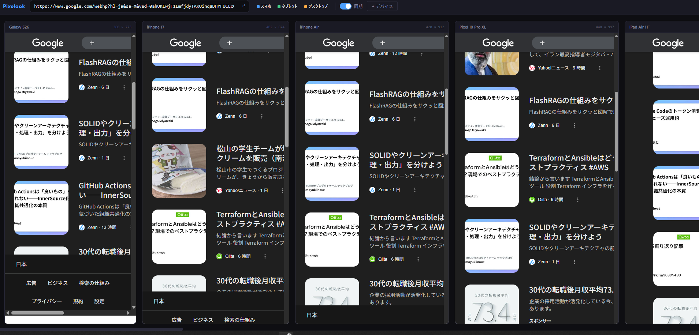

# Pixelook

マルチデバイス レスポンシブデザイン プレビュー Chrome拡張

任意のWebページを複数デバイスサイズで同時プレビューし、スクロール同期で一括確認できます。



## 機能

- **マルチビューポートプレビュー** — 任意のURLを複数デバイスサイズで横並び表示
- **スクロール同期** — 1つのビューポートをスクロールすると他も追従（パーセンテージベース）
- **1:1デバイス幅表示** — 各iframeを実際のCSSピクセル幅で描画
- **カテゴリフィルター** — スマホ / タブレット / デスクトップ の表示切替
- **17種のデバイスプリセット** — iPhone 17, Galaxy S26, Pixel 10, iPad Pro など（2026年最新データ）
- **カスタムデバイス** — 任意のサイズを追加可能
- **iframe制限の回避** — `X-Frame-Options` / `Content-Security-Policy` ヘッダーをプレビュータブのみで除去（tabIdスコープ）
- **ダークテーマUI**

## デフォルトデバイス

| デバイス | 幅 | 高さ | カテゴリ |
|----------|-----|------|----------|
| Galaxy S26 | 360 | 773 | スマホ |
| iPhone 17 | 402 | 874 | スマホ |
| iPhone Air | 420 | 912 | スマホ |
| Pixel 10 Pro XL | 448 | 997 | スマホ |
| iPad Air 11" | 820 | 1180 | タブレット |
| iPad Pro 13" | 1032 | 1376 | タブレット |
| Laptop | 1366 | 768 | デスクトップ |
| Desktop FHD | 1920 | 1080 | デスクトップ |

## インストール（開発者モード）

1. このリポジトリをクローン
   ```bash
   git clone https://github.com/s-nakk/Pixelook.git
   ```
2. Chromeで `chrome://extensions` を開く
3. 右上の **デベロッパーモード** を有効化
4. **パッケージ化されていない拡張機能を読み込む** をクリックし、クローンした `Pixelook` ディレクトリを選択
5. 任意のWebサイトを開いてツールバーのPixelookアイコンをクリック

## 使い方

1. 任意のWebページを開く
2. Pixelook拡張アイコンをクリック
3. 新しいタブにマルチデバイスプレビューが開く
4. **カテゴリフィルター**（スマホ / タブレット / デスクトップ）でデバイスグループを切替
5. **同期トグル** でスクロール同期のON/OFF
6. **+ デバイス** でデバイスの追加・削除・カスタム作成

## 仕組み

### ヘッダー除去

多くのサイトは `X-Frame-Options` や `Content-Security-Policy` ヘッダーでiframe埋め込みを拒否しています。Pixelookは Chrome の `declarativeNetRequest` API を使い、**プレビュータブのみ** (`tabIds` でスコープ) でこれらのヘッダーを除去します。他のタブには一切影響しません。プレビュータブを閉じるとルールも自動削除されます。

### スクロール同期

`chrome.scripting.executeScript` で各iframe内にコンテントスクリプトを注入し、スクロールイベントを検知。スクロール位置をパーセンテージとして `postMessage` で親ページに伝達し、他のiframeに転送します。クールダウン機構でフィードバックループを防止しています。

## パーミッション

| パーミッション | 理由 |
|----------------|------|
| `activeTab` | 現在のタブのURL取得 |
| `tabs` | プレビュータブの作成・閉鎖検知 |
| `scripting` | iframe内へのスクロール同期スクリプト注入 |
| `declarativeNetRequest` | iframe制限レスポンスヘッダーの除去 |
| `webNavigation` | iframeの読み込み完了検知（スクリプト注入タイミング） |
| `storage` | カスタムデバイスプリセットの保存 |
| `<all_urls>` | 任意ドメインでのヘッダー除去・スクリプト注入に必要 |

## 技術スタック

- Chrome Extension Manifest V3
- Vanilla JavaScript（ビルドステップなし、フレームワークなし）
- CSSカスタムプロパティによるテーマ管理

## ライセンス

[MIT](LICENSE)
